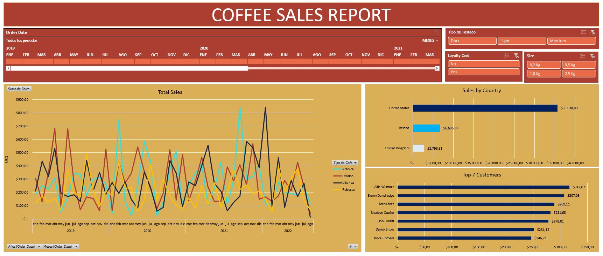

# Informe en Excel "Coffee Sales Report" - Reporte de Ventas

## Objetivo

En este trabajo me propuse analizar la evolución de las ventas de cafe y sus totales, de una determinada empresa, haciendo distinción entre 3 paises (Estados Unidos, Reino Unido e Irlanda) y las 	distintas variedades de cafe así como su tostado. Para ello la información una vez trabajada se presenta mediante un Dashboard interactivo

## Parte técnica

Para lograr el análisis, primero se realiza una limpieza y depuración de los datos, seguido de relacionarlo a través de distintas funciones con la base de datos de los clientes (customers) y darle los 	formatos adecuados. El resultado final, es la tabla que se encuentra en 'Orders (Worked)' habiendo partido de 'Orders (Original). Luego de esto se procedió con la creación de las Tablas dinámicas y la 	construcción final del Dasboard.
    

Recuerden que pueden descargar el archivo CoffeeSales_Report.xlsx para explorarlo personalmente.