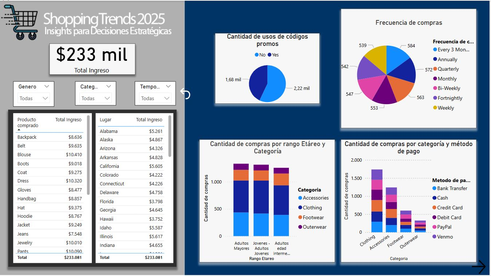
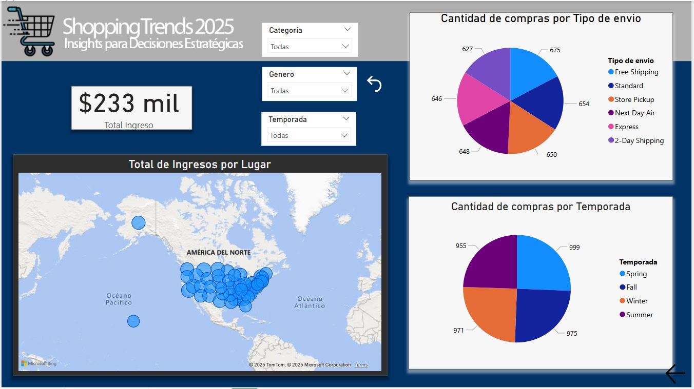

# Informe en PowerBI "Shopping Trends 2025: Insights para Decisiones Estratégicas" 

## Introducción

Bienvenidos.

En esta presentación les voy a mostrar un análisis interactivo de las Shopping Trends 2025, construido en Power BI. El objetivo principal es entender cómo están evolucionando los hábitos de consumo a lo largo del año, a través de diferentes dimensiones como la cantidad de compras, los valores transaccionados, las categorías de productos, la estacionalidad y las diferencias entre países.

También exploramos el impacto del uso de códigos promocionales: ¿los consumidores que usan cupones compran más? ¿Gastan menos? ¿En qué categorías se aplican más?

Este dashboard busca no solo mostrar datos, sino generar insights accionables para decisiones comerciales, estrategias de marketing y planificación de campañas.

Ahora los invito a recorrerlo juntos y descubrir qué nos dicen los datos de este 2025.

Recuerden que pueden descargar el archivo Shopping.pbix y el archivo de datos correspondiente (ubicado en la carpeta data) para analizarlo personalmente.