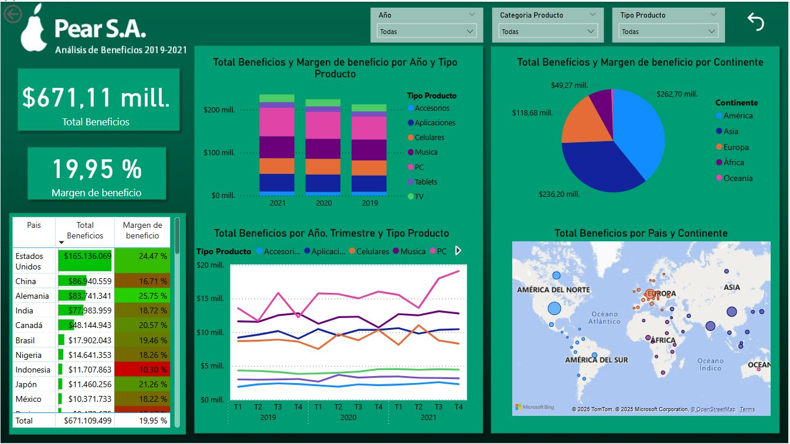

# Informe de la empresa Pear S.A
Cualquier parecido con la empresa de la manzana es pura casualidad.

## Introducción

Bienvenidos.

En esta presentación vamos a explorar el rendimiento reciente de Pear S.A. a través de un dashboard interactivo que analiza sus principales indicadores: beneficio, márgenes y evolución a lo largo del tiempo.

El análisis está segmentado por país, tipo de producto y categoría, lo que nos permite identificar no solo qué está funcionando, sino también dónde y en qué productos estamos generando más valor.

Vamos a ver cómo se comportan nuestros márgenes en distintos mercados, qué productos impulsan el beneficio, y qué oportunidades podemos detectar para seguir creciendo.

La idea es que este dashboard no solo muestre el desempeño actual, sino que también nos ayude a pensar estratégicamente los próximos pasos de la compañía.

Recuerden que pueden descargar el archivo Pear.pbix y el archivo de datos correspondiente (ubicado en la carpeta data) para analizarlo personalmente.