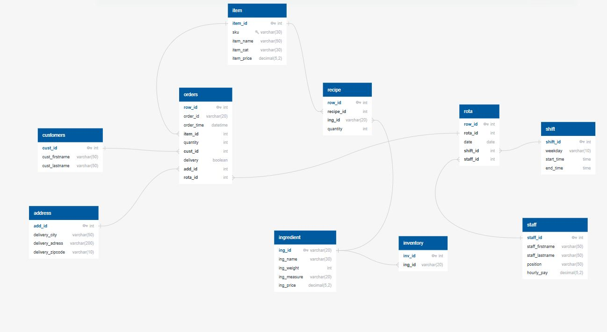
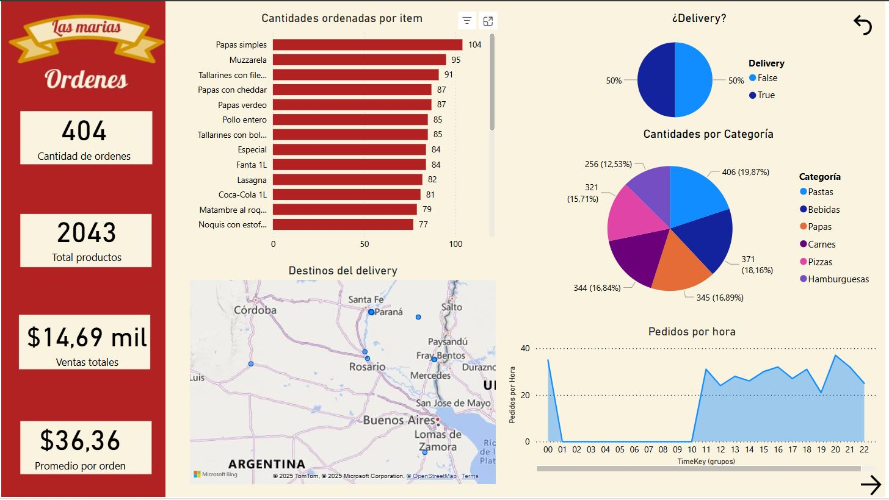
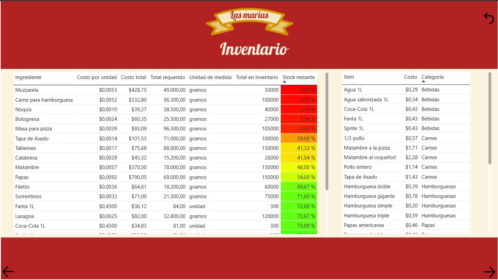
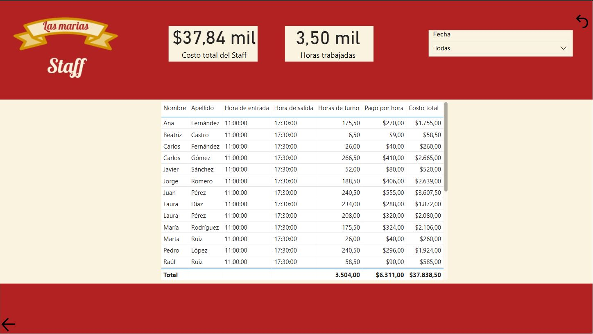

# Proyecto Las Marias

## Introducción

Bienvenidos.

En este proyecto trabajamos sobre una situación muy concreta: un cliente planea abrir una casa de comidas llamada "Las Marías", y necesita una solución para organizar y analizar los datos clave de su negocio.

A partir de eso, se identificaron tres áreas fundamentales: 
- 🔹 Órdenes. 
- 🔹 Inventario. 
- 🔹 Personal.

Lo que hice fue desarrollar una base de datos relacional en MySQL, estructurada para reflejar las operaciones del negocio. Luego, se realizó la carga de datos y la creación de vistas y consultas para facilitar el acceso a la información más relevante.

Finalmente, se construyó un dashboard en Power BI para visualizar los datos y obtener insights que puedan ayudar en la toma de decisiones, desde la gestión de recursos hasta el análisis de ventas y turnos de personal.

Los invito a recorrer este proyecto que combina diseño de base de datos, análisis y visualización aplicada a un caso realista y práctico.

## 1 - Creación de una base de datos relacional en SQL

Con las necesidades que nos transmite el cliente y el menú proporcionado del local, diseñamos un modelo relacional que incluye:
- 🔹 Tablas para almacenar órdenes, datos de clientes, direcciones e ítems vendidos.
- 🔹 Tablas de recetas e ingredientes, para gestionar los requerimientos de insumos.
- 🔹 Tablas de personal, turnos y rotaciones.

Si bien el modelo creado finalmente puede contener algunas diferencias, la estructura general es la siguiente:

Después de diseñar el modelo relacional para Las Marías, pasamos a la implementación en SQL. Para ello, seguimos tres pasos esenciales:
- 🔹 Creación de tablas: Definimos las estructuras para órdenes, clientes, productos, inventario y personal, asegurando integridad referencial.
- 🔹 Inserción de datos: Cargamos registros iniciales en cada tabla, estableciendo relaciones entre órdenes, ingredientes y turnos de trabajo.
- 🔹 Corrida de datos: Para validar la estructura y funcionalidad del sistema, realizamos una primera carga y prueba.

El script utilizado para la creación es el archivo 1_creacion_base_de_datos para que puedan explorarlo en profundidad, mientras que los datos cargados se encuentran en la carpeta data/las_marias

## 2 - Creación de las consultas pertinentes

Dadas las necesidades de la gerencia del local, debiamos realizar la extracción de los datos que precisabamos a fin de poder luego analizarlos.

- Consultas clave en SQL
Estas son las cuatro consultas principales que permiten gestionar el negocio:
    - 1️⃣ Control de órdenes: Seguimiento de ventas, cantidades vendidas, tipo de entrega (retiro/delivery) y ubicación de los pedidos.
    - 2️⃣ Costos de producción: Relaciona recetas, ingredientes y costos para evaluar el gasto en la preparación de pedidos.
    - 3️⃣ Stock disponible: Analiza el inventario restante y anticipa reposiciones necesarias.
    - 4️⃣ Gestión de personal: Control de horas trabajadas y pagos incurridos según turnos asignados.
Esas 4 consultas, las guardamos en vistas de SQL que serán recuperadas más adelante para elaborar los dashboards interactivos.

Las archivos que almacenan las VIEWS en cuestión son:
- 2_control_order.sql
- 2_ing_cost.sql
- 2_staff_control.sql
- 2_stock.sql

## 3 - Dashboards en Power BI - Análisis y Gestión Integral del Negocio 📊 
Después de modelar la base de datos y cargar la información, llega el paso clave: convertir los datos en decisiones estratégicas. Con Power BI, diseñamos dashboards para monitorear la marcha del negocio en tiempo real, integrando ventas, costos, stock e incluso la gestión del staff. 

🔹 ¿Qué analizamos en el dashboard? 
    - 📌 Ventas y demanda: Total por período, tipo de orden (retiro/delivery), franjas horarias de mayor movimiento, productos más ordenados e ingresos obtenidos. 
    - 📌 Control de costos: Análisis del margen de ganancia por producto y evolución de costos. 
    - 📌 Inventario y stock: Niveles de stock, productos con alta rotación e identificación de los ingredientes próximos a terminarse, para su reposición. 
    - 📌 Gestión del staff: Horas trabajadas, en cada turno y costo total del staff. 

🔹 Beneficios del dashboard: 
    - 📌 Mayor control operativo: Identificación de quiebres de stock y optimización de compras. 
    - 📌 Mejora en la rentabilidad: Visión clara de los márgenes de cada producto. 
    - 📌 Eficiencia en la planificación: Ajustes de turnos y recursos según demanda real. 

Mientras que el Dashboard en cuestión lo pueden encontrar en el archivo 'reporte_las_marias'
